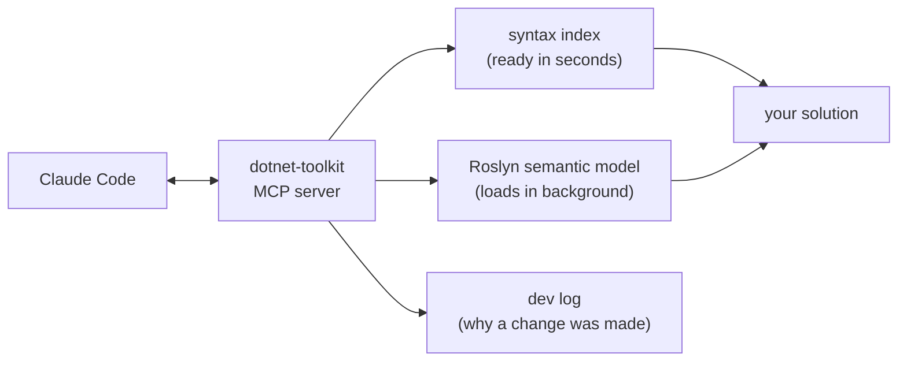
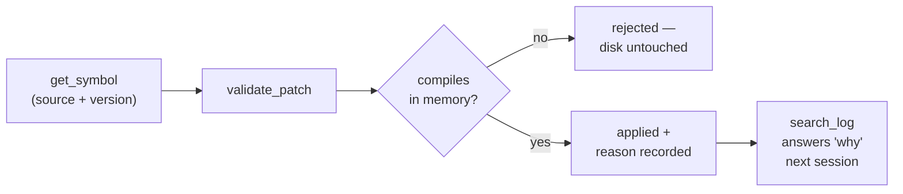

<p align="center"><strong>A Claude Code plugin that lets Claude read your C# through the compiler.</strong></p>

## Example 1 — "Where is the fee calculation?"

### Without the plugin

```
grep -rn "Fee" --include=*.cs .
```

```
./Billing/Invoicing/InvoiceBuilder.cs:41:    // Fee is applied before tax; see ADR-014
./Billing/Invoicing/InvoiceBuilder.cs:88:        var fee = _fees.Calculate(line);
./Billing/Payments/PaymentProcessor.cs:12:    /// Fee handling moved out of this class in 2024.
./Billing/Payments/PaymentProcessor.cs:210:        _log.LogInformation("Fee applied: {Fee}", fee);
./Tests/Billing/FeeCalculatorTests.cs:33:    public void Fee_IsRoundedHalfUp()
... 94 more matches
```

### With the plugin

```
search_index(query: "fee calculate tier", limit: 10)
```

```
shape: "L=lines(150+) M=members(20+) D=doclines C=commentlines(10+); D absent = zero"
groupedBy: namespace
namespaces[2]:
  - name: Billing.Fees
    files[2]:
      - path: src/Billing/Fees/FeeCalculator.cs
        kind: Method
        symbols[2]{symbolId,name,line,endLine,shape}:
          sym_4c1e9a77b2d0f318,"FeeCalculator.Calculate(Invoice, Customer)",64,152,L88 D6
          sym_9b30d5e41af7c206,"FeeCalculator.CalculateTier(decimal)",154,171,D4
      - path: src/Billing/Fees/TieredFeeStrategy.cs
        kind: Class
        symbols[1]{symbolId,name,line,endLine}:
          sym_71ba0c93ee54d18a,TieredFeeStrategy,9,58
  - name: Billing.Invoicing
    files[1]:
      - path: src/Billing/Invoicing/InvoiceBuilder.cs
        kind: Method
        symbols[1]{symbolId,name,line,endLine}:
          sym_2ef8ab6104c7d955,"InvoiceBuilder.ApplyFees(InvoiceLine)",81,96,D3
termsWithNoHits[1]: tier
```

---

## Example 2 — "How does the tier rounding work?"

### Without the plugin

```
Read("src/Billing/Fees/FeeCalculator.cs")
```

```
     1  using System;
     2  using System.Collections.Generic;
     3  using System.Globalization;
     4  using System.Linq;
     5  using Billing.Contracts;
     6  using Billing.Fees.Strategies;
     7  using Microsoft.Extensions.Logging;
     8
     9  namespace Billing.Fees;
    10
    11  /// <summary>
    12  /// Calculates invoice fees. Historically this also owned proration, which moved to
    13  /// <see cref="ProrationService"/> in 2024 — see ADR-014 for the migration notes and
    14  /// the compatibility shims that are still referenced by the legacy import path.
    15  /// </summary>
    16  /// <remarks>Not thread-safe. Resolve one instance per unit of work.</remarks>
    17  [SuppressMessage("Design", "CA1062", Justification = "Validated by the caller")]
    18  public sealed partial class FeeCalculator
    19  {
    20      private readonly IFeeStrategy _strategy;
    21      private readonly ILogger<FeeCalculator> _log;
    22
    23      /// <summary>Creates a calculator backed by the supplied strategy.</summary>
    24      /// <param name="strategy">The tier strategy. Must not be null.</param>
    25      public FeeCalculator(IFeeStrategy strategy)
    26      {
    27          _strategy = strategy ?? throw new ArgumentNullException(nameof(strategy));
    28      }
    29
    30      /// <summary>The configured fee tiers, ordered by ceiling ascending.</summary>
... 1,074 more lines
```

### With the plugin

**Step 1 — the type's surface, no bodies at all.**

```
get_symbol(symbol: "Billing.Fees.FeeCalculator", include: "members")
```

```
symbolId: sym_1f27b0ce34a8d952
contentVersion: "decl:0bda88313473"
content:
  kind: Type
  displayString: FeeCalculator
  declarationSites[1]{file,startLine,endLine}:
    src/Billing/Fees/FeeCalculator.cs,18,1104
  members[5]{symbolId,displayString,kind,contentVersion}:
    sym_a4d0117e6c39fb82,"FeeCalculator.FeeCalculator(IFeeStrategy strategy)",Method,"decl:9f7fbdd8b72f|body:257c1be96ae6"
    sym_4c1e9a77b2d0f318,"decimal FeeCalculator.Calculate(Invoice invoice, Customer customer)",Method,"decl:41b98ff7712a|body:dfbfe6312777"
    sym_9b30d5e41af7c206,"decimal FeeCalculator.CalculateTier(decimal amount)",Method,"decl:bd84be7dbe29|body:4f36d90fff16"
    sym_5ce947012b081873,"decimal FeeCalculator.RoundHalfUp(decimal value)",Method,"decl:f3ef1e46968f|body:2436492cabe1"
    sym_e1fffa1b19b2e0aa,IReadOnlyList<FeeTier> FeeCalculator.Tiers,Property,"decl:06fe50c5de05|body:f75bcaefa9c7"
```

**Step 2 — a map of the long method, still without reading it.**

```
get_symbol(symbol: "sym_4c1e9a77b2d0f318", include: "bodyOutline")
```

```
content:
  kind: Method
  declarationSites[1]{file,startLine,endLine}:
    src/Billing/Fees/FeeCalculator.cs,64,152
  bodyOutline:
    if (invoice.Lines.Count == 0),71,73
    foreach(var line in invoice.Lin..),78,124
      switch(line.Kind),81,118
        case LineKind.Subscription,83,91
        case LineKind.Usage,93,108
          foreach(var tier in Tiers),97,105
            if (remaining <= tier.Ceiling),100,104
        case _,110,117
    if (customer.IsExempt),128,131
```

**Step 3 — exactly those lines, comments and docs stripped.**

```
get_symbol(symbol: "sym_4c1e9a77b2d0f318", include: "source:code@97-105")
```

```
content:
  kind: Method
  displayString: "decimal FeeCalculator.Calculate(Invoice invoice, Customer customer)"
  source:
     97:             foreach (var tier in Tiers)
     98:             {
     99:                 var applicable = Math.Min(remaining, tier.Ceiling);
   100:                 if (remaining <= tier.Ceiling)
   101:                 {
   102:                     total += RoundHalfUp(applicable * tier.Rate);
   103:                     break;
   104:                 }
   105:                 remaining -= applicable;
```

Nine lines. That is the answer to the question that was asked.

---

## How it works

The plugin runs a local MCP server that holds a Roslyn model of your solution — the same compiler your
IDE and `dotnet build` use. Claude asks it questions instead of reading files.



Four pieces ship together:

- **The MCP server** — the tools in the tables below. It parses every `.cs` file up front so
  `search_index`/`get_symbol` answer almost immediately, and loads the full MSBuild semantic model in the
  background for `get_references`, `validate_patch` and the rest.
- **Skills** — teach Claude to reach for those tools rather than `grep`/`Read`/`Edit`.
- **Guard hooks** — block the fallback when it reaches for them anyway.
- **Agents** — `dotnet-explore` for read-only navigation, `dotnet-code-review` for review, each with its
  own context.

Nothing runs in the cloud, nothing runs through a shell, and the caches live in your repo under
`.claude/dotnet-toolkit/cache/` — self-gitignored and rebuildable from source at any time.

---

## What the agent misses without a semantic model

Grep and `Read` are not just slower on C# — they are **wrong**, and confidently so.

### It finds things that are not there

| What it really is | What text search matches |
|---|---|
| **A comment** | `// Fee is applied before tax` |
| **XML documentation** | `/// <see cref="FeeCalculator"/>` |
| **A string literal** | `_log.LogInformation("Fee applied: {Fee}", fee)` |
| **A test name** | `public void Fee_IsRoundedHalfUp()` |
| **A build-output copy** | `obj/Debug/net10.0/…FeeCalculator.g.cs` |

### It misses things that are there

| What text search never connects | How the call site reads |
|---|---|
| **Interface dispatch** | `_strategy.Calculate(line)`, implemented by `TieredFeeStrategy` |
| **Virtual dispatch** | `base.Calculate(...)`, or an `override` in a derived type |
| **Delegates and event handlers** | `_calculate(line)`, where `_calculate` is a `Func<>` |
| **Inherited members** | `invoice.Calculate()`, declared on a base class |
| **Aliases and `global using`** | `using Fee = Billing.Fees.FeeCalculator;` |
| **Overload resolution** | `Calculate(x)`, where three overloads exist |
| **Partial types** | `partial class FeeCalculator` — one fragment, no signal the rest exists |
| **Truncation** | `... 94 more matches` — and most tools do not even say that |

### It cannot tell you anything about a symbol

| The question | Why text search has no answer |
|---|---|
| "Just show me this method" | There are no symbol boundaries — the unit is the file, all 1,104 lines of it |
| "Is this dead code?" | A count of matches is not a count of references; *zero* is a guess, not a fact |
| "Is this called from production, or only tests?" | Both are text in `.cs` files |
| "Has this changed since I read it?" | Nothing identifies a version, so two edits race silently |
| "Why was it written this way?" | The reasoning was never recorded anywhere |

The cost is not the wasted tokens. It is a refactor built on an answer that was missing call sites, and
a build that breaks days later.

## What answers what

You talk to Claude normally; the skills route the work. What changes is underneath:

| You ask | Without the plugin | With the plugin |
|---|---|---|
| "Where is the fee calculation?" | `grep` for a name, then filter comments by hand | **`search_index`** — ranked symbols, all terms in one call |
| "How does this method work?" | `Read` the whole file it lives in | **`get_symbol`** — that symbol, across every partial file |
| "What breaks if I change this signature?" | `grep` for the name and hope | **`get_references`** — the compiler's own answer, dispatch included |
| "Who ends up calling this?" | Trace call sites by hand, one hop at a time | **`get_call_hierarchy`** — the tree, several levels deep |
| "How do these projects fit together?" | Open every `.csproj` | **`get_project_graph`**, **`detect_circular_dependencies`** |
| "Rename this and fix the callers" | Search-and-replace, then fix the build | **`rename_symbol`** — every edit derived from the reference graph |
| "Make this change" | `Edit`, then `dotnet build`, then fix | **`validate_patch`** — compiled in memory; nothing lands unless it holds |
| "Why is this written this way?" | Guess from `git blame` | **`search_log`** — the intent recorded when it was written |
| "Where would this feature land?" | Open files until a pattern emerges | **`dotnet-explore`** — symbols, use sites and blast radius, read-only |
| "Review this subsystem" | Review inline, in a context full of other work | **`dotnet-code-review`** — fresh context, shared standards |

Guard hooks block `Read`/`Edit` on compiled `.cs` files and name the tool to use instead, so Claude
cannot quietly fall back to text search mid-session.

## Writing is checked before it lands



Nothing reaches disk unless a real compilation holds, your `.editorconfig` decides what counts as broken,
and every applied change records *why* it was made.

It is an **add-in**. It never replaces your repo's CLAUDE.md, your conventions, or your build.

---

## Getting it running

### Requirements

- **.NET 10 SDK** — the server targets `net10.0`, and the projects it analyzes need their own SDK
  present.
- **Claude Code.**
- Run `dotnet restore` in your repo at least once, **in the same OS you run Claude Code in**. (A restore
  done in Windows does not satisfy a WSL session, and vice versa.)

### 1. Clone and build

Not in a public marketplace yet — the repo itself is the install source.

**Linux, macOS, or WSL:**

```bash
git clone https://github.com/Attemainio/dotnet-toolkit dotnet-toolkit
cd dotnet-toolkit
./scripts/build-plugin.sh
```

**Windows:**

```
git clone https://github.com/Attemainio/dotnet-toolkit dotnet-toolkit
cd dotnet-toolkit
scripts\build-plugin.cmd
```

Both are wrappers over `dotnet publish src/DotnetToolkit.McpServer -c Release -o dist`. Run it once now,
and again after every `git pull` — `dist/` is what actually executes.

Everything the plugin runs is invoked as `dotnet <dll>`, never through a shell, so the same install works
identically on all four platforms.

### 2. Load the plugin

**Just trying it out** — point Claude Code at the clone. Nothing is written to any config; closing the
session is the entire uninstall.

```bash
claude --plugin-dir /path/to/dotnet-toolkit
```

**Keeping it** — register the clone as a local marketplace once, and it loads in every future session.

```
/plugin marketplace add /path/to/dotnet-toolkit
/plugin install dotnet-toolkit@dotnet-toolkit-local
```

### 3. Wire it into your repo

Installing makes the tools *available*. It does not make a fresh session *prefer* them — and a plugin
cannot auto-load coding standards, so this step is not optional if you want either.

```
/dotnet-toolkit-init
```

It shows you the exact plan and writes only after you approve, backing up anything it touches. It adds
one small always-loaded rule plus the coding standards to your `.claude/rules/`, and **never modifies
your CLAUDE.md**.

Then confirm the wiring took:

```
/dotnet-toolkit-install-check
```

> **After any update**, re-publish to `dist/`. That replaces the server running in every open session, so
> run `/plugin reload-plugins` or restart to pick the rebuilt one up.

### Uninstall

- **Loaded with `--plugin-dir`**: stop passing the flag. Nothing was recorded anywhere.
- **Installed from the local marketplace**: `/plugin uninstall dotnet-toolkit@dotnet-toolkit-local`, then
  `/plugin marketplace remove dotnet-toolkit-local`, then `/plugin reload-plugins`.

The MCP server and the guard hooks travel *with* the plugin — they stop the moment it unloads. If you ran
`/dotnet-toolkit-init`, the files it wrote into your `.claude/` are yours to keep or delete;
`/dotnet-toolkit-install-check` lists exactly what a clean removal touches.

### If something looks wrong

| Symptom | What it means |
|---|---|
| Tools say the workspace is still loading | The MSBuild model builds in the background so startup stays instant. `search_index`/`get_symbol` already answer from the syntax index; `workspace_status` shows progress. |
| `workspace_status` says **DEGRADED** | A project failed to load and its reference edges are missing — results for it are incomplete, not wrong-but-complete. Anything that breaks `dotnet build` breaks this too. Usually a missing `dotnet restore`. |
| Results look stale | Change detection is mtime-polling (so it works on WSL `/mnt/*`, where inotify does not fire). `reload_workspace` forces a refresh. |

Optional per-repo settings live in `.claude/dotnet-toolkit/config.json` — pinning a solution when several
exist, and excluding generated code from the index. See
[`docs/architecture.md`](docs/architecture.md).

---

## Please run the self-evaluation

**This step is what makes the plugin better, and it only works if you do it.**

```
/dotnet-toolkit-selfeval
```

It runs a fixed probe over every tool against *your* repo and measures each call's exact token cost. It
is read-only — it never changes your code, and every finding is about **this plugin**, never about your
codebase.

Your repo is the point. This plugin has been tuned against a handful of solutions, and every codebase has
structural shapes the tools have not met yet: deep partial classes, big overload sets, generated code,
`.slnx` vs `.sln`, projects that fail to load. Those are exactly the conditions under which a tool quietly
underperforms, and the evaluation is the only thing that surfaces them.

### 👉 [Open an issue with your self-eval report](https://github.com/Attemainio/dotnet-toolkit/issues/new)

Include the report as-is, plus your solution's rough size (projects / `.cs` files) and anything unusual
about its layout. The report contains tool names, token counts, and call routes — **no source code**. Skim
it before posting if your repo is private.

---

## Learn more

| | |
|---|---|
| [`docs/tools/_index.md`](docs/tools/_index.md) | **Start here** — which tool answers which question, plus a page per tool |
| [`docs/skill-reference.md`](docs/skill-reference.md) | What each skill does |
| [`docs/agent-reference.md`](docs/agent-reference.md) | The review and exploration agents |
| [`docs/hook-reference.md`](docs/hook-reference.md) | The guard hooks and what they block |
| [`docs/architecture.md`](docs/architecture.md) | How the server is built: startup, knowledge tiers, subsystems, packaging, configuration |
| [`CLAUDE.md`](CLAUDE.md) | The operating contract for working on the plugin itself |

## Development

```bash
dotnet build
dotnet test                                                      # unit + MSBuildWorkspace integration tests
dotnet publish src/DotnetToolkit.McpServer -c Release -o dist    # required after any src/ change
```

`TreatWarningsAsErrors` is set repo-wide, so a build with warnings fails. If more than one .NET 10 SDK is
installed, build with the same one the server picks for MSBuild — it logs `MSBuild: ...` to stderr at
startup, and `DOTNET_TOOLKIT_DOTNET_ROOT` pins it.

Layout: `src/DotnetToolkit.McpServer/` (the server — `Tools/` is the MCP surface), `tests/`, `skills/`,
`agents/`, `.claude/rules/` (coding standards), `docs/`, `.claude-plugin/` (manifests), `.mcp.json`.
[`docs/architecture.md`](docs/architecture.md) explains how the pieces fit.

Issues and self-eval reports: **https://github.com/Attemainio/dotnet-toolkit/issues**
