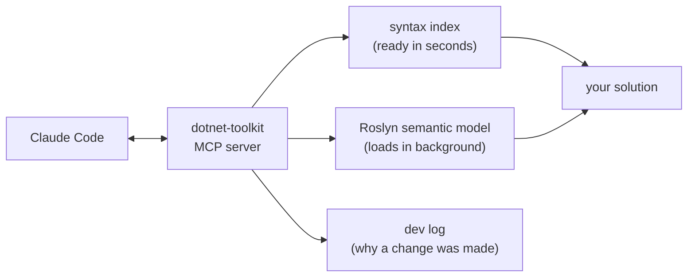

# dotnet-toolkit

**Compiler-aware C# code intelligence for Claude Code.**

dotnet-toolkit runs a local MCP server holding a Roslyn model of your solution — the same compiler your
IDE and `dotnet build` use. Claude asks it for symbols, references, call trees and type hierarchies
instead of reading files, and every edit is compiled in memory before it reaches disk.

- **Fewer wrong answers** — real dispatch, overloads, inheritance and partial classes, not text matches.
- **Less context burned** — [measured](#measured-against-raw-tools) at 2.6× less injected into the
  context window than the same questions answered with `Read`/`Grep`, across two real solutions.
- **Safer edits** — a patch that does not compile never lands, and every applied change records *why*.
- **Local by design** — nothing leaves your machine; caches live in your repo and rebuild from source.

> **Status:** beta · **Requires:** Claude Code and the .NET 10 SDK · **Platforms:** Windows, Linux,
> macOS, WSL · **Install:** clone this repo — no build step, not in a public marketplace yet.

[Quick start](#quick-start) · [Benchmarks](docs/benchmarks.md) · [Installation](docs/installation.md) ·
[Tool reference](docs/tools/) · [Architecture](docs/design/architecture.md) ·
[Contributing](CONTRIBUTING.md)

---

## Quick start

`dist/` is committed, so there is nothing to build:

```bash
git clone https://github.com/Attemainio/dotnet-toolkit
claude --plugin-dir /path/to/dotnet-toolkit
```

Loading the plugin this way does not modify Claude Code's configuration — stop passing the flag and it
is gone. Then, inside Claude Code, wire it into the repo you want to work on:

```text
/dotnet-init
```

`/dotnet-init` is the step that writes files. It shows you the exact plan first and writes only after
you approve: one always-loaded router rule, the MCP tools added to your permission allowlist, and a
record of what it installed. It never touches your CLAUDE.md.

Now ask Claude something you would normally grep for. To find out whether it is paying for itself on
*your* codebase rather than the two solutions benchmarked below:

```text
/dotnet-performance
```

[Keeping it across sessions, updating, uninstalling and troubleshooting →](docs/installation.md)

---

## Measured against raw tools

Each run sends one identical question list, blind, to two subagents: one granted **only** these MCP
tools, one granted **only** `Read`/`Grep`/`Glob`/`Bash`. Both are metered by the same hook, and ground
truth is established independently after both return.

**21 questions across two solutions** — a private 290-file trading/ML codebase and this repository:

| | With the plugin | Raw tools | Ratio |
|---|---:|---:|---:|
| **Correct answers** | **18 / 21** | 17 / 21 | |
| Tool calls | **46** | 102 | 2.2× |
| **Tool-result tokens** — what lands in context | **25,582** | 66,793 | **2.6×** |
| Tool-call argument tokens — model output | **824** | 4,339 | 5.3× |
| Total agent tokens — including reasoning | **87,159** | 136,405 | 1.6× |

Token figures are `chars4` approximations applied identically to both routes, so the ratios hold while
the absolute numbers do not. **The raw route won several individual questions** — enumerating a 13-file
partial class outright, and exact-name lookups on cost — and those losses are published in full
alongside the method, the per-question breakdown and what the results do *not* transfer to.

[Full benchmarks, caveats and where the raw route won →](docs/benchmarks.md)

---

## Why compiler-aware retrieval

Text search locates matching characters. Roslyn resolves C# symbols. That difference decides:

- **Dispatch** — interface, virtual, delegate and receiver-less calls share no text with their target.
- **Overload resolution** — which `Calculate(x)` of three you actually meant.
- **Inheritance and partial classes** — a member declared on a base type, a type split across 13 files.
- **What is even code** — comments, XML docs, string literals, test names, generated files under
  `obj/`, and whole methods disabled by an unclosed block comment all match a grep and compile to
  nothing.
- **Absence** — "no references" and "no references I could see" are the same output from a text search,
  and on a delete decision that distinction is the whole question.

Text search stays the right tool for exact textual questions, and it is genuinely competitive on an
exact, distinctive name. dotnet-toolkit is for the questions where C# semantics decide the answer.

---

## What it can do

You talk to Claude normally; the skills pick the tools.

- **Find and read symbols** without loading whole files — including across every fragment of a partial
  class.
- **Trace relationships** — callers, implementations, overrides, base chains, the shortest path between
  two functions, project graphs and dependency cycles.
- **Size a change** — the blast radius of a signature edit, with dispatch included.
- **Validate patches against the compiler** before anything is written to disk.
- **Rename symbols** from the reference graph rather than search-and-replace.
- **Explain history** — which symbols a branch actually changed and which changes are breaking, plus a
  development log recording *why* each past change was made.
- **Report its own cost** — per-call token accounting, so retrieval spend is measurable rather than
  assumed.

Two agents do wide work in their own context instead of yours: `dotnet-explore` for read-only
navigation, `dotnet-code-review` for review against shared standards.

[Full tool reference](docs/tools/) · [Worked example with real responses](docs/examples/compiler-aware-navigation.md)

---

## How it works



1. **A syntax index is ready in seconds**, so `search_index` and `get_symbol` answer almost immediately
   after startup.
2. **The full MSBuild semantic model loads in the background**, enabling `get_references`,
   `validate_patch` and the rest. Tools say which tier answered rather than guessing.
3. **Claude retrieves symbols and relationships over MCP** instead of reading files.
4. **Proposed patches compile in memory first.** Nothing reaches disk unless a real compilation holds;
   your `.editorconfig` decides what counts as broken, and the reason for the change is recorded.
5. **Guard hooks block the fallback** — `Read`/`Edit` and shell reads on compiled `.cs` files are
   refused with a pointer to the tool that covers what you were doing.

The server and its hooks are invoked directly as `dotnet <dll>`, never through a shell, so nothing the
plugin runs while inspecting or modifying your source can execute an arbitrary command. Responses use
**TOON** by default — the same field names JSON carries with far fewer delimiters, which is a large part
of why these tools cost less than the reads they replace. `set_output_format(format: "json")` switches.

It is an **add-in**. It never replaces your repo's CLAUDE.md, your conventions, or your build.

---

## Known limitations

- **Not in a public marketplace.** Installation is a `git clone`.
- **Anything that breaks `dotnet build` breaks the semantic tools.** A project that fails to load
  reports `DEGRADED` rather than guessing — thin results, not wrong ones — but you must fix the build
  to get the full answer.
- **Tool response shapes are not yet stable.** They are versioned in `Contracts/Contract.cs` and do
  change between releases.
- **Benchmarked on solutions up to ~500 types across 3 projects.** Larger monorepos are untested, and
  the write path has not been benchmarked against raw tools at all.
- **C# only.** F#, VB.NET and non-`.cs` files are ordinary `Read`/`Grep` territory.

---

## Documentation

| | |
|---|---|
| [Installation](docs/installation.md) | Persistent install, updating, uninstalling, troubleshooting |
| [Benchmarks](docs/benchmarks.md) | Method, full results, caveats, and where raw tools won |
| [Tool reference](docs/tools/) | One page per tool: arguments, a real call and response, what to call next |
| [Worked example](docs/examples/compiler-aware-navigation.md) | What the tools exchange to answer one question |
| [Architecture](docs/design/architecture.md) | Server internals, startup order, packaging |
| [Contributing](CONTRIBUTING.md) | Building, layout, invariants, and reporting how the tools behave on your repo |

Contributors can run `/dotnet-selfeval` to surface inefficient or incomplete tool responses on a repo
that is not this one — the findings are always about the plugin, never about your code.

Issues: <https://github.com/Attemainio/dotnet-toolkit/issues>

MIT licensed.
